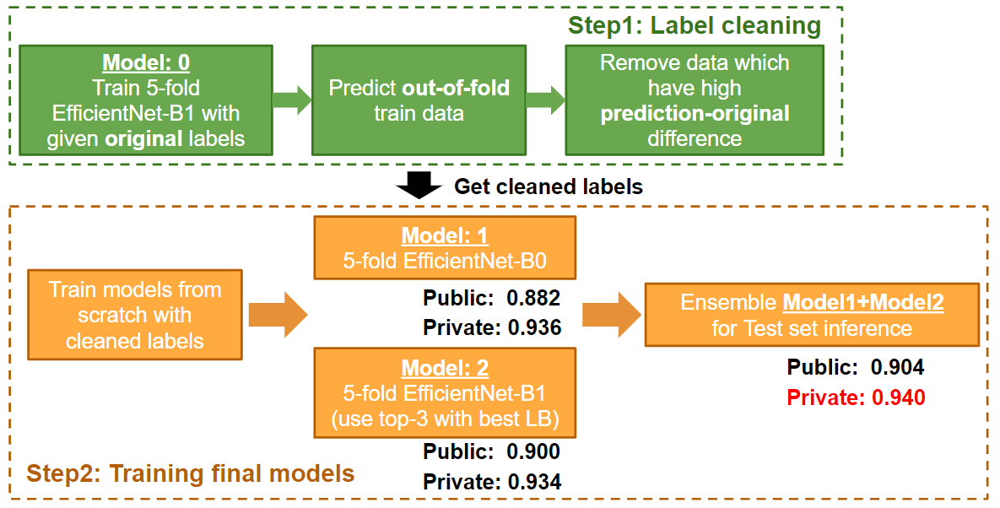

# Kaggle-PANDA-1st-place-solution


This is the 1st place solution of the [PANDA Competition](https://www.kaggle.com/c/prostate-cancer-grade-assessment), where the specific writeup is [here](https://www.kaggle.com/c/prostate-cancer-grade-assessment/discussion/169143).

The codes and models are created by Team PND, [@yukkyo](https://github.com/yukkyo) and [@kentaroy47](https://github.com/kentaroy47).

Our model and codes are open sourced under `CC-BY-NC 4.0`. Please see LICENSE for specifics.

You can skip some steps (because some outputs are already in `input` dir).

## Slide describing our solution!
https://docs.google.com/presentation/d/1Ies4vnyVtW5U3XNDr_fom43ZJDIodu1SV6DSK8di6fs/

## 1. Environment

You can choose using docker or not.

### 1.1 Don't use docker (haven't tested..)

- Ubuntu 18.04
- Python 3.7.2
- CUDA 10.2
- NVIDIA/apex == 1.0 installed

```bash
# main dependency
$ pip install -r docker/requirements.txt
# arutema code dependency
$ pip install git+https://github.com/ildoonet/pytorch-gradual-warmup-lr.git
$ pip install efficientnet_pytorch
```

### 1.2 Use docker (Recommended)

```bash
# build
$ sh docker/build.sh

# run
$ sh docker/run.sh

# exec
$ sh docker/exec.sh
```

## 2. Preparing

### 2.1 Get Data

Download only train_images and train_masks.

```bash
$ cd input
$ kaggle download ...
$ unzip ...
```

### (skip) 2.2 Grouping imageids by image hash threshold

- If you want to do it on your own: https://www.kaggle.com/yukkyo/imagehash-to-detect-duplicate-images-and-grouping
- We will just place the output of the script as: 
  - `input/duplicate_imgids_imghash_thres_090.csv`

### (skip) 2.3 Split kfold

```bash
$ cd src
$ python data_process/s00_make_k_fold.py
```

- Is constant with fixed seed
- output:
  - `input/train-5kfold.csv`

### 2.4 Make tile pngs for training

```bash
$ cd src
$ python data_process/s07_simple_tile.py --mode 0
$ python data_process/s07_simple_tile.py --mode 2
$ python data_process/a00_save_tiles.py
$ cd ../input
$ cd numtile-64-tilesize-192-res-1-mode-0
$ unzip train.zip -d train
$ cd ..
$ cd numtile-64-tilesize-192-res-1-mode-2
$ unzip train.zip -d train
$ cd ..
```

## 3. Train base model for removing noise(expected TitanRTX x 1)

Each fold needs about 18 hours.

```bash
$ cd src
$ python train.py --config configs/final_1.yaml --kfold 1
$ python train.py --config configs/final_1.yaml --kfold 2
$ python train.py --config configs/final_1.yaml --kfold 3
$ python train.py --config configs/final_1.yaml --kfold 4
$ python train.py --config configs/final_1.yaml --kfold 5
```

- output:
  - `output/model/final_1`
    - Each weights and train logs

## 4. Predict to local validation for removing noise

Each fold needs about 1 hour.

```bash
$ cd src
$ python kernel.py --kfold 1
$ python kernel.py --kfold 2
$ python kernel.py --kfold 3
$ python kernel.py --kfold 4
$ python kernel.py --kfold 5
```

- outputs are prediction results of the hold-out train data:
  - `output/model/final_1/local_preds~~~.csv`

## 5. Remove noise

```bash
$ cd src
$ python data_process/s12_remove_noise_by_local_preds.py
```

- output:
  - `output/model/final_1`
    - `local_preds_final_1_efficientnet-b1.csv`
      - Concatenated prediction results of the hold-out data
      - This is used to clean labels
    - `local_preds_final_1_efficientnet-b1_removed_noise_thresh_16.csv`
      - Used to train Model 1
      - Base label cleaning results
    - `local_preds_final_1_efficientnet-b1_removed_noise_thresh_rad_13_08_ka_15_10.csv`
      - Used to train Model 2
      - Label cleaned to remove 20% Radboud labels
- FYI: we used this csv at final sub on competition: (did not fix seed at time)
  - `input/train-5kfold_remove_noisy_by_0622_rad_13_08_ka_15_10.csv`

## 6. Re-train 5-fold models with noise removed

- You can replace `output/train-5kfold_remove_noisy.csv` to `input/train-5kfold_remove_noisy_by_0622_rad_13_08_ka_15_10.csv` in config

- Only 1,4,5 folds are used for final inference

- Each fold needs about 15 hours.

  ## Training model 2(fam_taro model):

```bash
$ cd src
# only best LB folds are trained
$ python train.py --config configs/final_2.yaml --kfold 1
$ python train.py --config configs/final_2.yaml --kfold 4
$ python train.py --config configs/final_2.yaml --kfold 5
```

## Training model 1(arutema model):

Please run `train_famdata-kfolds.ipynb` on jupyter notebook or

```bash
# go to home
$ python train_famdata-kfolds.py
```

I haven't tested .py, so please try .ipynb for operation.

The final models are saved to `models`.

Each fold will take 4 hours.

## Trained models

Models reproducing 1st place score is saved in `./final_models`

## 7. Submit on Kaggle Notebook

- kernels
  - final sub on competition: 
    - score: public 0.904, private 0.940 (1st)
    - url: https://www.kaggle.com/yukkyo/latesub-pote-fam-aru-ensemble-0722-ew-1-0-0?scriptVersionId=39271011
  - reproduced results (seed fixed as in this scripts, you can reproduce)
    - score: public 0.894, private 0.939 (1st)
    - url: https://www.kaggle.com/kyoshioka47/late-famrepro-fam-reproaru-ensemble-0725?scriptVersionId=39879219
    - `submitted_notebook.ipynb`
  - Simple 5-fold model to get private 0.935(3rd)
    - url: https://www.kaggle.com/kyoshioka47/5-fold-effb0-with-cleaned-labels-pb-0-935
    
- You can change paths by changing bellow.  
  - You must change Kaggle Dataset path for using your reproduced weights

```python
### Model 2
# Line [7]
class Config:
    def __init__(self, on_kernel=True, kfold=1, debug=False):
        ...
        ...
        ...

        # You can change weight name. But not need on this README
        self.weight_name = "final_2_efficientnet-b1_kfold_{}_latest.pt"
        self.weight_name = self.weight_name.format(kfold)

        ...
        ...
        ...

    def get_weight_path(self):
        if self.on_kernel:
            # You should change this path to your Kaggle Dataset path
            return os.path.join("../input/030-weight", self.weight_name)
        else:
            dir_name = self.weight_name.split("_")[0]
            return os.path.join("../output/model", dir_name, self.weight_name)
       
### Model 1
# Line [13]
def load_models(model_files):
    models = []
    for model_f in model_files:
        ## You should change this path to your Kaggle Dataset path
        model_f = os.path.join("../input/latesubspanda", model_f)
        ...

model_files = [
    'efficientnet-b0famlabelsmodelsub_avgpool_tile36_imsize256_mixup_final_epoch20_fold0.pth',
]

model_files2 = [
    'efficientnet-b0famlabelsmodelsub_avgpool_tile36_imsize256_mixup_final_epoch20_fold0.pth',
    "efficientnet-b0famlabelsmodelsub_avgpool_tile36_imsize256_mixup_final_epoch20_fold1.pth",
    "efficientnet-b0famlabelsmodelsub_avgpool_tile36_imsize256_mixup_final_epoch20_fold2.pth",
    "efficientnet-b0famlabelsmodelsub_avgpool_tile36_imsize256_mixup_final_epoch20_fold3.pth",
    "efficientnet-b0famlabelsmodelsub_avgpool_tile36_imsize256_mixup_final_epoch20_fold4.pth"
]
        
```

